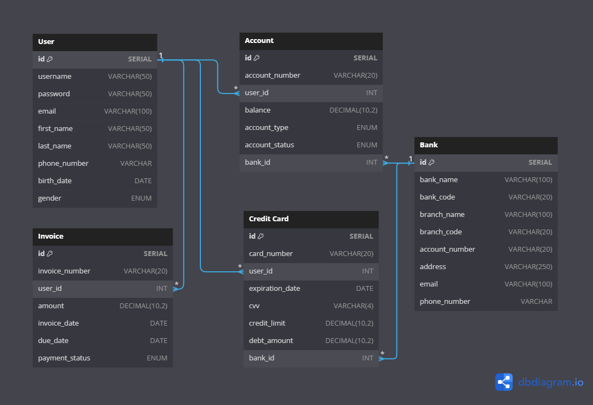

# `Banking-Microservices`

## `Contents`
- [Introduction](#Introduction)
- [Software Architecture](#software-architecture)
- [Database Entity Relationships](#database-entity-relationships)
- [Technology Stack](#technology-stack)
- [Build and Run Project](#build-and-run-project)
- [Service Endpoints](#service-endpoints)

## `Introduction`
> This backend project was bootstrapped with [Java Spring Boot](https://spring.io)

> This backend project was designed and developed to stand up services that simulate basic banking
> transactions and use them as a whole

> This backend project was developed using microservice architecture, a distributed approach to building
> software systems. In microservice architecture, the application is divided into multiple loosely coupled
> services, each tasked with different functions. These services communicate with each other via HTTP
> requests and message queues

## `Software Architecture`

**Components that make up the architecture of the project:**

### Discovery Client Service
* The discovery server, implemented using Eureka, is responsible for service discovery and registration. 
It allows services to locate and communicate with each other without prior knowledge of network topology.
* This service can be accessed from port **[8761]**

### Api Gateway Service
* The API gateway, implemented using Spring Cloud Gateway, acts as a single entry point for clients to 
access various microservices. It provides routing, filtering, and load balancing functionalities, 
making it easier to manage and secure the system's API's.
* This service can be accessed on port **[8087]**

### User Service
* This service handles user transactions in the microservice application.
* This service can be accessed from port **[8081]**

### Bank Service
* This service handles bank transactions in the microservice application.
* This service can be accessed from port **[8082]**

### Credit Card Service
* This service handles credit card transactions in the microservice application.
* This service can be accessed from port **[8083]**

### Account Service
* This service handles account transactions in the microservice application.
* This service can be accessed from port **[8084]**

### Invoice Service
* This service handles invoice transactions in the microservice application.
* This service can be accessed from port **[8085]**

### Log Service
* This service handles log transactions in the microservice application.
* This service can be accessed from port **[8086]**

## `Database Entity Relationships`


## `Technology Stack`
- **JDK 21**
- **Java 21**
- **Spring Boot**
- **Spring Core**
- **Spring Web**
- **Spring Data**
- **Spring Rest**
- **Spring Cloud (Eureka Server, Eureka Discovery Client, Gateway)**
- **PostgreSQL**
- **MongoDB**
- **Redis**
- **Docker**
- **Feign Client**
- **MapStruct**
- **Maven**
- **JUnit**
- **Mockito**
- **Lombok**

## `Build and Run Project`
> Requires **JDK 21** to run the project, **Git** to pull from remote repository, and **Docker** to run docker-compose

Follow the steps to build and run the project:
- Clone the repository from Git
```bash
  git clone https://github.com/emre-unaldi/Banking-Microservices.git banking-microservices 
```
- Open the project file
```shell
  cd banking-microservices 
```
- Run the project with Docker
```shell
  docker-compose up -d && docker-compose down 
```
After all services are up and running with `Docker`:
- `PgAdmin4` interface can be accessed from port **5050**
- `Redis insight` interface can be accessed from port **5540**
- `RabbitMQ` interface can be accessed from port **15672**
- `Mongo Express` interface can be accessed from port **8088**
> All running services can access dependent graphic interfaces via the web without being dependent on the local environment.

## `Service Endpoints`

### `User Service Endpoints`
| Route                  | HTTP     | Request Body                                                                                                                                                                                | Description 	     |
|------------------------|----------|---------------------------------------------------------------------------------------------------------------------------------------------------------------------------------------------|-------------------|
| /api/v1/users          | `POST`   | {"username":"john_doe","password":"john1221","email":"john.doe@email.com","firstName":"John","lastName":"Doe","phoneNumber":"05551234567","birthDate":"1990-05-15","gender":"MALE"}         | Create a new user |
| /api/v1/users          | `PUT`    | {"id":1,"username":"john_doe","password":"john1221","email": "john.doe@email.com","firstName":"John","lastName":"Doe","phoneNumber":"05551234567","birthDate":"1990-05-15","gender":"MALE"} | Update a user     |
| /api/v1/users/{userId} | `DELETE` | Empty                                                                                                                                                                                       | Delete user by id |
| /api/v1/users/{userId} | `GET`    | Empty                                                                                                                                                                                       | Get user by id    |
| /api/v1/users          | `GET`    | Empty                                                                                                                                                                                       | List users        |

### `Bank Service Endpoints`
| Route                  | HTTP     | Request Body                                                                                                                                                                                                                                | Description 	     |
|------------------------|----------|---------------------------------------------------------------------------------------------------------------------------------------------------------------------------------------------------------------------------------------------|-------------------|
| /api/v1/banks          | `POST`   | {"bankName":"City Bank","bankCode":"CTYB","branchName":"City Bank Main Branch","branchCode":"CTYMB","accountNumber":"98765432","address":"123 Maple Ave, Cityville, USA","email":"info@citybank.com","phoneNumber":"0507 987 65 43"}        | Create a new bank |
| /api/v1/banks          | `PUT`    | {"id":1,"bankName":"City Bank","bankCode":"CTYB","branchName":"City Bank Main Branch","branchCode":"CTYMB","accountNumber":"98765432","address":"123 Maple Ave, Cityville, USA","email":"info@citybank.com","phoneNumber":"0507 987 65 43"} | Update a bank     |
| /api/v1/banks/{bankId} | `DELETE` | Empty                                                                                                                                                                                                                                       | Delete bank by id |
| /api/v1/banks/{bankId} | `GET`    | Empty                                                                                                                                                                                                                                       | Get bank by id    |
| /api/v1/banks          | `GET`    | Empty                                                                                                                                                                                                                                       | List banks        |

### `Credit Card Service Endpoints`
| Route                              | HTTP     | Request Body                                                                                                                                       | Description 	                   |
|------------------------------------|----------|----------------------------------------------------------------------------------------------------------------------------------------------------|---------------------------------|
| /api/v1/creditCards                | `POST`   | {"cardNumber":"1234567890123456","userId":5,"expirationDate":"2025-12-15","cvv":"789","creditLimit":3000.00,"debtAmount":200.00,"bankId":6}        | Create a new credit card        |
| /api/v1/creditCards                | `PUT`    | {"id":1,"cardNumber":"1234567890123456","userId":5,"expirationDate":"2025-12-15","cvv":"789","creditLimit":3000.00,"debtAmount":200.00,"bankId":6} | Update a credit card            |
| /api/v1/creditCards/{creditCardId} | `DELETE` | Empty                                                                                                                                              | Delete credit card by id        |
| /api/v1/creditCards/{creditCardId} | `GET`    | Empty                                                                                                                                              | Get credit card by id           |
| /api/v1/creditCards                | `GET`    | Empty                                                                                                                                              | List credit cards               |
| /api/v1/creditCards/users/{userId} | `GET`    | Empty                                                                                                                                              | Get credit card user by user id |
| /api/v1/creditCards/banks/{bankId} | `GET`    | Empty                                                                                                                                              | Get credit card bank by bank id |

### `Account Service Endpoints`
| Route                           | HTTP     | Request Body	                                                                                                                   | Description 	               |
|---------------------------------|----------|---------------------------------------------------------------------------------------------------------------------------------|-----------------------------|
| /api/v1/accounts                | `POST`   | {"accountNumber":"304958349584","userId":3,"balance":5000.00,"accountType":"CREDIT","accountStatus":"ACTIVE","bankId":7}        | Create a new account        |
| /api/v1/accounts                | `PUT`    | {"id":1,"accountNumber":"304958349584","userId":3,"balance":5000.00,"accountType":"CREDIT","accountStatus":"ACTIVE","bankId":7} | Update a account            |
| /api/v1/accounts/{accountId}    | `DELETE` | Empty                                                                                                                           | Delete account by id        |
| /api/v1/accounts/{accountId}    | `GET`    | Empty                                                                                                                           | Get account by id           |
| /api/v1/accounts                | `GET`    | Empty                                                                                                                           | List accounts               |
| /api/v1/accounts/users/{userId} | `GET`    | Empty                                                                                                                           | Get account user by user id |
| /api/v1/accounts/banks/{bankId} | `GET`    | Empty                                                                                                                           | Get account bank by bank id |

### `Invoice Service Endpoints`
| Route                           | HTTP     | Request Body                                                                                                                                   | Description 	               |
|---------------------------------|----------|------------------------------------------------------------------------------------------------------------------------------------------------|-----------------------------|
| /api/v1/invoices                | `POST`   | {"invoiceNumber":"INV-2024-038","userId":2,"amount":180.25,"invoiceDate":"2023-07-01","dueDate":"2024-02-01","paymentStatus":"PENDING"}        | Create a new invoice        |
| /api/v1/invoices                | `PUT`    | {"id":1,"invoiceNumber":"INV-2024-038","userId":2,"amount":180.25,"invoiceDate":"2023-07-01","dueDate":"2024-02-01","paymentStatus":"PENDING"} | Update a invoice            |
| /api/v1/invoices/{invoiceId}    | `DELETE` | Empty                                                                                                                                          | Delete invoice by id        |
| /api/v1/invoices/{invoiceId}    | `GET`    | Empty                                                                                                                                          | Get invoice by id           |
| /api/v1/invoices                | `GET`    | Empty                                                                                                                                          | List invoices               |
| /api/v1/invoices/users/{userId} | `GET`    | Empty                                                                                                                                          | Get invoice user by user id |

### `Log Service Endpoints`
| Route                | HTTP     | Request Body	                                                                                                                                                                                                                                | Description 	    |
|----------------------|----------|----------------------------------------------------------------------------------------------------------------------------------------------------------------------------------------------------------------------------------------------|------------------|
| /api/v1/logs         | `POST`   | {"serviceName":"account-service","operationType":"GET","logType":"INFO","message":"Accounts in the database are listed","requestPath":"/api/v1/accounts","timestamp":"2024-04-25T12:00:00","exception":null}                                 | Create a new log |
| /api/v1/logs         | `PUT`    | {"id":"661c2ba9278f996c640cd220","serviceName":"account-service","operationType":"GET","logType":"INFO","message":"Accounts in the database are listed","requestPath":"/api/v1/accounts","timestamp":"2024-04-25T12:00:00","exception":null} | Update a log     |
| /api/v1/logs/{logId} | `DELETE` | Empty                                                                                                                                                                                                                                        | Delete log by id |
| /api/v1/logs/{logId} | `GET`    | Empty                                                                                                                                                                                                                                        | Get log by id    |
| /api/v1/logs         | `GET`    | Empty                                                                                                                                                                                                                                        | List logs        |

